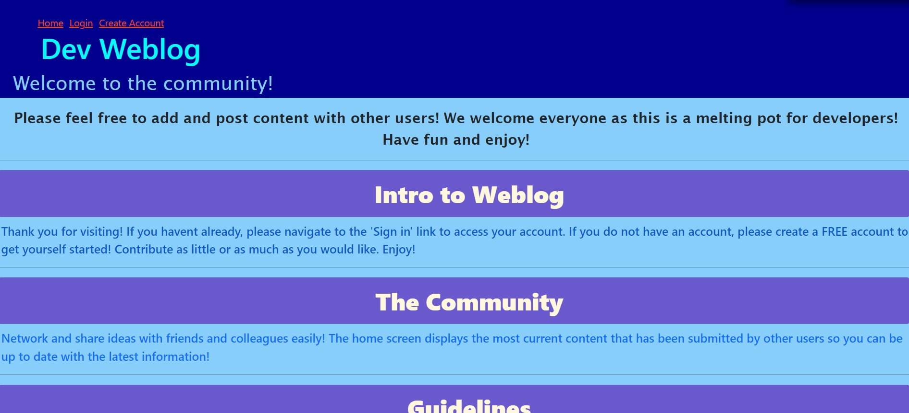

# dev-weblog

# <dev-weblog>

## Description

Introducing an innovative and interactive tech blog that can be utilized as a resource, melting-pot, and conversation-starter for developers.

## Table of Contents

- [Installation](#installation)
- [Usage](#usage)
- [Credits](#credits)
- [License](#license)

## Installation

This application does not require installation. 

## Usage

Once homepage is launched, navigate to the login or signup link listed at the top of the page. Once the account is created, click on the dashbaord link then create a post, then submit! 

## Credits

https://github.com/julianr3/dev-weblog

## License

MIT License

## Badges

